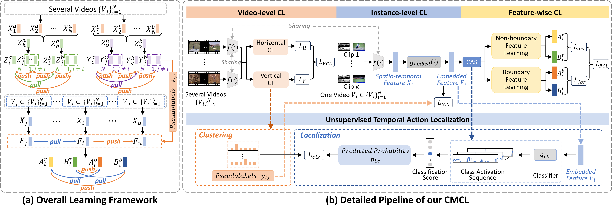

# CMCL

 

We propose a novel coarse-to-fine contrastive learning framework for UTAL, called CMCL, which consists of three hierarchical CL, namely video level, instance level, and feature-wise level, trained in an end-to-end multi-task manner. 

## Results

Comparison of state-of-the-art methods on the THUMOS'14 dataset in fully supervised, weakly supervised, and unsupervised learning settings, respectively. We denote the fully supervised, weakly supervised, and unsupervised as FS, WS, and US, respectively. The best results are in bold.


## Dependencies

- python 3.7.9
- pytorch 1.7.1
- cuda 11.6
- cudnn 8.5.0

## Test

```bash
python test.py
```

## Models

Due to space limitations, model files cannot be transferred. We provide a [link](https://pan.baidu.com/s/1Zd7NjpreM0eTKeTtajHvKQ?pwd=skts ) to download them by clicking on it.

## Features

The feature files of the THUMOS'14 dataset are placed [here](https://pan.baidu.com/s/1C4060pUX9GgeZOdNFQo8yg?pwd=pinh ). After downloading, place them in the data/THUMOS14 directory.

